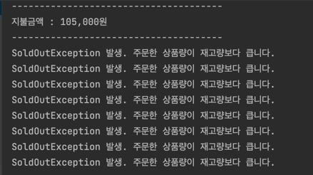

# 29CM 백엔드 개발자 과제
## 기술 스택
Java - 8 <br>
Spring - 5.3.19 <br>
SpringBoot - 2.6.7 <br>
Spring Data Jpa - 2.6.4 <br>
Lombok - 1.18.24 <br>
H2 - 1.4.200 <br>
Junit - 5.8.2 <br>
Mockito - 4.0.0

## 프로젝트 실행
1. 어플리케이션 실행시 @ApplicationRunner 인터페이스를 상속받은 TestDataRunner 클래스가 실행되어 h2 데이터베이스에 product 데이터 저장
2. product 데이터 저장 후 @CommandLineRunner 인터페이스를 상속 받은 OrderApplication 클래스가 실행되어 콘솔 어플리케이션 실행

## 구현 방향
- 기존에 이커머스 서비스를 구현할때는 Order 엔티티와 Product 엔티티를 
OrderProduct 엔티티라는 중간 엔티티로 엮어 M:M 연관관계를 1:M:1로 풀어서 설계

- 이번 프로젝트에서는 요구사항에서 회원 관련 기능 구현이 없었고 주문 프로세스만 구현하면 됐었기 때문에
연관관계 없이 Order 엔티티와 Product 엔티티를 따로 설계하여 구현

## 프로젝트 구조
- homework <br>
    - entity <br>
        - Order <br>
        - Product <br>
    - repository <br>
        - OrderRepository <br>
        - ProductRepository <br>
    - service <br>
        - OrderService <br>
        - ProductService <br>
    - testdata <br>
        - TestDataRunner <br>
- HomewordkApplication <br>
- OrderApplication

### ProductService
- getAllProduct() : 주문 선택시 상품리스트 조회
- getProduct() : 주문 테이블에 추가하기 위해 상품 단건 조회
- checkProduct() : 상품번호 입력시 존재하는 상품인지 체크

### OrderService
- addOrder() : 주문 테이블에 getProduct() 메소드로 조회한 상품 추가
- doOrder() : " " 입력시 주문테이블에 들어가 있는 상품 주문
- checkProductStock() : 주문 수량이 재고 수량보다 많은지 체크
- getTotalPriceAndPrintOrderList() : 주문 리스트 출력 및 전체 주문 상품 가격 계산

## 멀티스레드 요청으로 OrderService 단위테스트
### Runnable 인터페이스 상속 이유
스레드를 구현하기 위해서는 Thread 클래스를 상속받거나 Runnable 인터페이스를 상속받는 2가지 경우가 있는데
Runnable 인터페이스 상속의 경우 다중 상속이 가능하고 재사용성이 높아 
코드의 일관성을 유지할 수 있다는 장점이 있어 보다 객체지향적인 방법

### 테스트 결과
```java
Product product = Product.builder()
                .productNumber((long) 768848)
                .productName("[STANLEY] GO CERAMIVAC 진공 텀블러/보틀 3종")
                .productPrice(21000)
                .productStock(45)
                .build();
```
하나의 Product를 생성하고 4개의 쓰레드를 생성하여 5개씩 20번 주문을 했을때 9번의 주문 성공과 11번의 SoldOutException 이 발생해야 함


하지만 테스트 결과 SoldOutException 결과가 랜덤하게 출력되었고 4개의 스레드가 동시에 doOrder() 메소드에 접근하여 재고 개수가 제대로 카운트 안되서 발생하는 문제

```java
@Transactional
    public synchronized boolean doOrder() {
        DecimalFormat decFormat = new DecimalFormat("###,###");
        ...
        ...
        orderRepository.deleteAll();
        return false;
    }
```

addOrder() 메소드에 synchronized를 선언하여 동시성 문제 해결